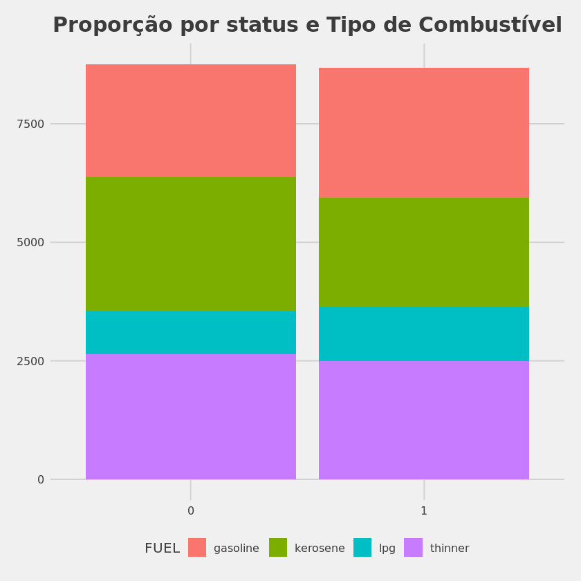
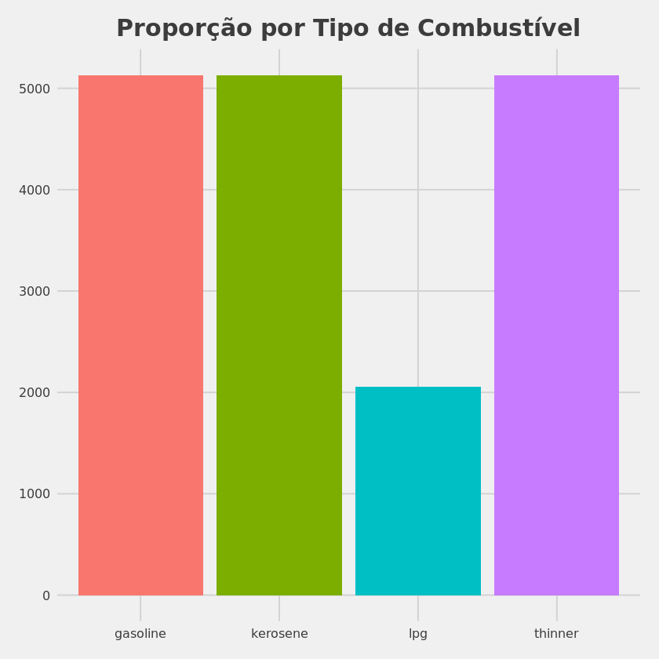
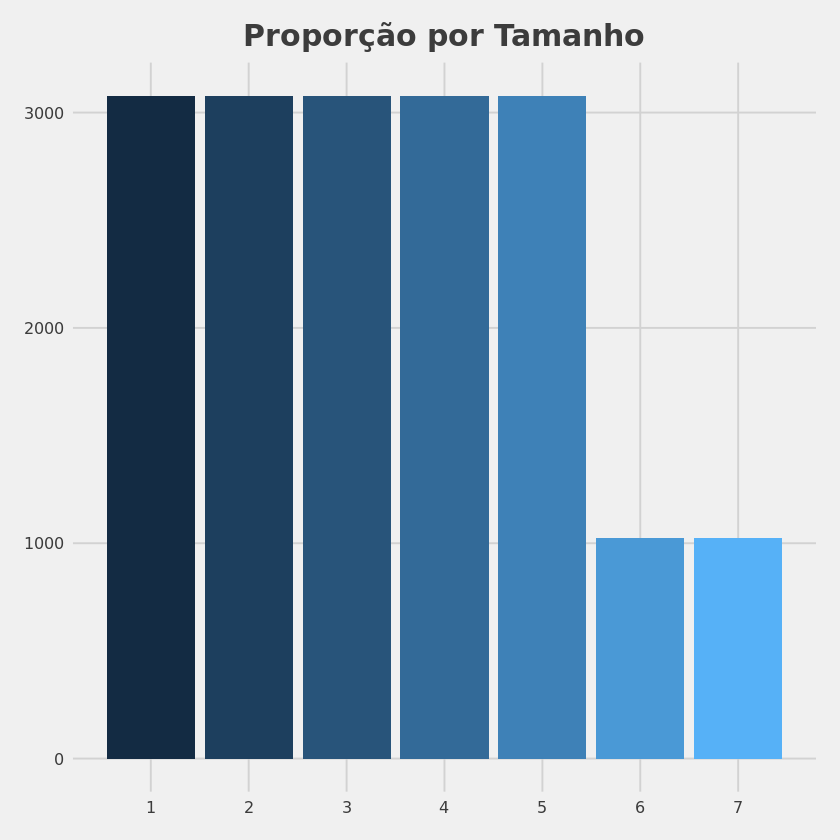
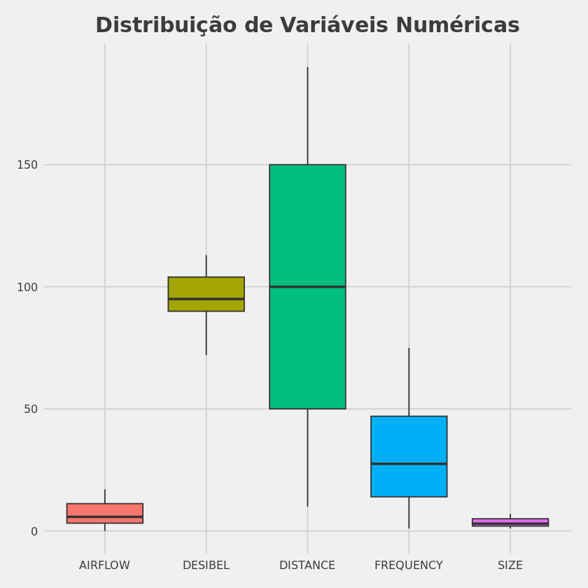

# Projeto de Big Data Analytics com R e Microsoft Azure Machine Learning

## Introdução

O objetivo desse projeto é criar um modelo de Machine Learning para prever a eficiência de um extintor de incêndio. Para isso, foi utilizado dados desse [link](https://www.muratkoklu.com/datasets/vtdhnd07.php).

## Sumário

- [Extração dos dados](./Scripts/extracao.py)
- [Processamento de Dados](./Notebook/Processamento.ipynb)
- [Análise Exploratória de Dados](./Notebook/AnaliseExploratoriaDados.ipynb)
- [Modelo de Machine Learning](./Notebook/Modelagem.ipynb)

## Limpeza dos dados

O conjunto de dados em questão já estava bem limpo e não foi necessário realizar muitas alterações. Utilizando do conjunto de pacotes do Tidyverse, foram realizadas alguns mudanças na tipagem das variáveis e a transformação do conjunto de dados em um arquivo '.parquet', já que este formato é capaz de salvar a tipagem das variáveis com o bonus de ser mais leve e rápido.

## Análise Exploratória de Dados

A análise exploratória de dados foi realizada com o objetivo de entender melhor o conjunto de dados e identificar possíveis problemas que poderiam prejudicar o modelo de Machine Learning. 

Primeiramente, houve uma preocupação no balanceamento das classes, já que, caso houvesse uma grande desproporção entre elas, o modelo poderia ter problemas em generalizar. No entanto, o conjunto de dados já estava bem balanceado tanto em relação ao número total de casos quanto em relação ao número de casos para cada tipo de combustível diferente. O gráfico abaixo mostra a proporção de cada classe em relação ao total de casos.

Em seguida, foi realizada uma análise da proporção de cada tipo de combustível em relação ao total. Como podemos observar pelo gráfico abaixo, houve uma sub-representação de casos de extintores de tipo 'lpg' diante aos demais. Isso pode ser um problema, já que o modelo pode acabar não aprender a classificar tão bem quanto os demais casos.

Essa sub-representação tem efeitos na variável relacionada ao tamanho do extintor. Como podemos observar no gráfico abaixo, o tamanho do extintor 6 e 7 aparecem menos nos dados que os demais tamanhos. E, de acordo com os metadados, o tamanho 6 e 7 são apenas para extintores com combustível 'lpg'.

Por fim, foi realizada uma análise na distribuição dos demais dados numéricos. Como podemos observar no gráfico abaixo, os dados, dentro de sua categoria, estão bem distribuídos. Isso é um bom sinal, já que indica que não há outliers. No entanto, é notável que estão em escalas diferentes, o que pode prejudicar o modelo de Machine Learning. Dessa forma, no processo de modelagem, será útil realizar uma normalização dos dados, já que certos algoritmos de Machine Learning são sensíveis a escalas diferentes.

## Modelo de Machine Learning

A maior preocupação durante o processo de modelagem inicialmente foi identificar qual seria o algoritmo mais adequado para o problema. Utilizando o pacote Caret, foi criado uma série de funções para testar diversos algoritmos de Machine Learning e identificar qual deles apresentava o melhor resultado. Foi testado os algoritmos:

- Random Forest
- Support Vector Machine com kernel radial
- Decision Tree
- Generalized Boosted Model
- XGBoost Tree

Como podemos observar, os algoritmos de Random Forest e XGBoost Tree apresentaram os melhores resultados e os resultados foram bem similares. Dessa forma, o simples uso dessas métricas não é suficiente para identificar qual algoritmo é o melhor. Para isso, foi analisado a matriz de confusão de cada um dos algoritmos. A matriz de confusão é uma tabela que mostra a quantidade de acertos e erros de cada classe. No caso, a classe 0 representa os extintores que foram testados e falharam em apagar o fogo e a classe 1 representa os extintores que também foram testados, mas conseguiram apagar o fogo.

| Algoritmo | Acurácia | Kappa | Precisão | Recall | F1 | AUC |
|:------|---------:|------:|----------:|-------:|---:|----:|
| rf | 0.9680749 | 0.9361485 | 0.9680365 | 0.9684050 | 0.9682207 | 0.9680735 |
| xgbTree | 0.9673103 | 0.9346167 | 0.9633962 | 0.9718310 | 0.9675952 | 0.9672903 |
| svmRadial | 0.9462818 | 0.8925573 | 0.9426415 | 0.9508946 | 0.9467500 | 0.9462614 |
| glm | 0.9004015 | 0.8007713 | 0.8885609 | 0.9166349 | 0.9023796 | 0.9003298 |
| rpart | 0.8864462 | 0.7729277 | 0.9028934 | 0.8671488 | 0.8846602 | 0.8865314 |

Como podemos observar nas matrizes de confusão abaixo, a diferença entre os algoritmos se deram principalmente entre a quantidade de falso positivo e falso negativo. Como o problema em questão é prever a eficácia dos extintores, o falso positivo é mais prejudicial que o falso negativo, já que é melhor descartar um extintor que esteja funcionando do que manter um extintor que, caso haja necessidade de uso, falhe em apagar o fogo. Dessa forma, foi escolhido o algoritmo que possuem a menor quantidade de falso positivo, nesse caso, o algoritmo de XGboost foi escolhido para ser utilizado no modelo final.

**Random Forest**

| | Observado: 0 | Observado: 1 |
|:------|---------:|------:|
| **Previsto: 0** |  2544 | 84 |
| **Previsto: 1** | 83 | 2520 |

**XGBoost**

| | Observado: 0 | Observado: 1 |
|:------|---------:|------:|
| **Previsto : 0** |  2553 | 97 |
| **Previsto : 1** | 74 | 2507 |

Após a escolha do algoritmo, foi realizado um processo de otimização dos hiperparâmetros do modelo. Foi testado alguns valores para os hiperparâmetros como número de árvores, profundidade máxima das árvores, taxa de aprendizado e número de variáveis a serem consideradas em cada nó. Como na criação do modelo, foi utilizado o pacote Caret. O modelo final obteve uma melhora de cerca de 20% na identificação de falsos positivos. Apesar de não ter havido uma grande melhora em termos de evitar que um extintor não funcional seja identificado, podemos ressaltar que a melhor identificação dos falsos positivos pode significar uma economia de tempo e dinheiro, já que bons extintores não precisam ser descartados. A matrix de confusão do modelo final é mostrada abaixo.

| | Observado: 0 | Observado: 1 |
|:------|---------:|------:|
| **Previsto: 0** |  2555 | 74 |
| **Previsto: 1** | 72 | 2530 |

## Conclusão

Caso o modelo não atenda completamente as demandas em termos de capacidade preditiva, seria possível intensificar o processo de tunagem dos hyperparametros, que só não foi tão aprofundado por limitações de Hardware. Além disso, com auxílio de um especialista, seria possível a obtenção de novas variáveis tanto através da feature engineering quanto da obtenção de mais dados. Por fim, seria possível a utilização de algoritmos mais complexos como redes neurais, que podem ser mais eficientes em problemas de classificação. 
